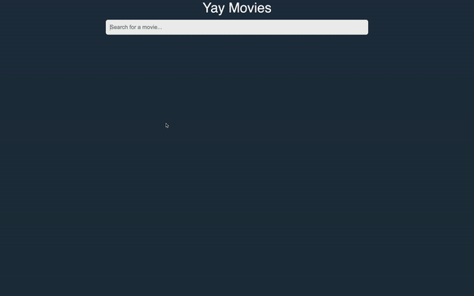
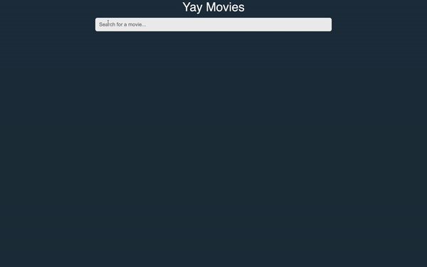

# Yay Movies

Search through movies, click on movie for more info, and vote a Like (Thumbs Up) or Dislike (Thumbs Down).

The Open Movie Database: http://www.omdbapi.com/

## Features

Search a Title and browse Movie Selections

Click on a Movie and get More Information

Vote Like or Dislike where information is stored in a DataBase

## Set Up And Run Project

1. Clone project locally
2. In your CLI, run `npm install`
3. Add your own API Key after Setting up file `.env` 
\* Get API key by registering with OMDb(link in description).
4. On root file, use CLI to run `npm start`
5. App running on `https://localhost:3000`

## Technologies

- React.JS
- Firebase - Realtime Database
- Html
- CSS
- Font Awsome
- The Open Movie Database - OMDb API

